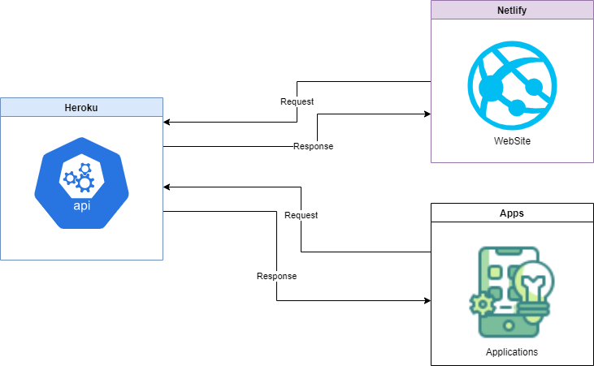

# Todoz 📚

Todoz is a to-do list app, it has minimal functionality, and will allow you to access your to-do list via mobile or website.

The purpose behind this is learning and it's not ready for production env.

## Features ⭐

- User management []
  - Adding a new user [x]
  - Limiting the user []
  - Delete a user [x]
- User authentication [x]
  - User registration [x]
  - User login [x]
  - User logout [x]
- User profile [x]
- Settings [x]
  - Edit the account information [x]
  - Changing the account password [x]
  - Deleting the account [x]
- To-do list management []
  - Add a new to-do item [x]
  - Deleting a to-do item []
  - Editing a to-do item []

## Main architecture 🖥️

This is the main architecture of the app and it may change over time.



## Install the requirements 🍳

First of all, we need to install docker and docker-compose in your system. for installation guidelines you can visit the official documentation of docker.

[Docker Installation Guidelines](https://docs.docker.com/engine/install/)

after you installed the docker and docker-compose successfully, you can safely go to the next levels

## Development environment 👨‍💻

You can enter into the development environment with the commands below:

```bash
# Build the docker images needed
$ docker-compose --profile development build

# Enter into the backend development environment
# Port 3000 for the api documention
# And port 8080 for the rest api
$ docker-compose run --rm -p 3000:3000 -p 8080:8080 backend_development
```

After exiting from the development environment, run the below commands to stop all of the services:

```bash
# Stop all of the services
$ docker-compose down

# if you want to delete the volumes to
$ docker-compose down --volumes
```

## Production environment 🚀

To run all of the services you need to access and run the website and mobile app you can run the commands below:

> <span style="color:red;">Note:</span> This environment is for local and if you want to deploy it you must integrate it with the specific options that the service provider requires.

```bash
# Building the images
$ docker-compose --profile production build

# Start the services
$ docker-compose --profile production up -d
```

---

> <span style="color:red;">Note:</span> This app is under development, and this readme will be completed in the process of development.
